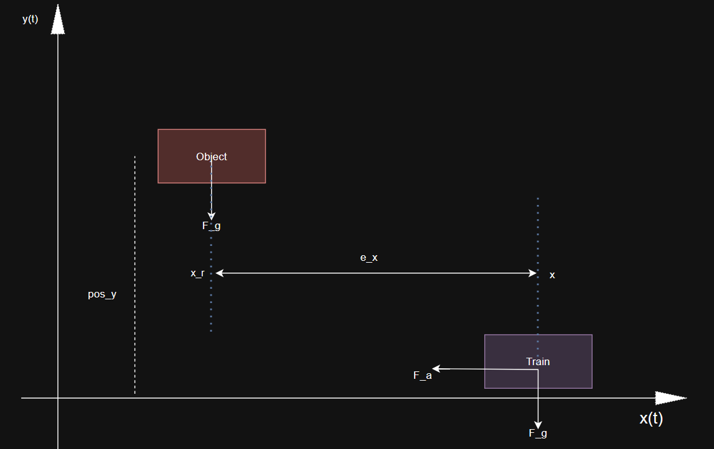
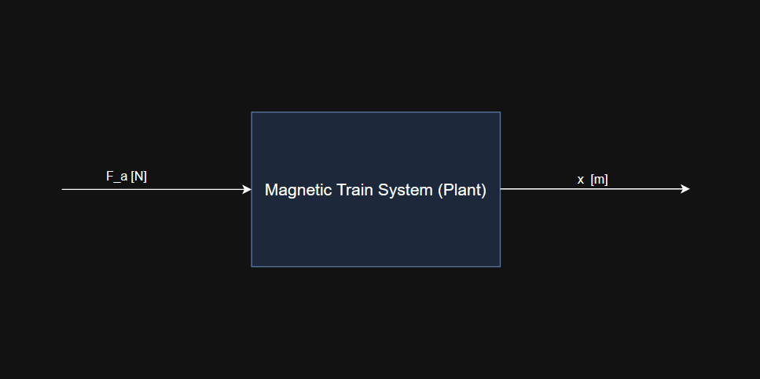

# Designing a PID controller for a magnetic train which tries to catch an object

- The train can only move in horizontal direction (left or right) by the applied force F_a produced by the magnets on the railway track. We assume that the train is magnetic train so that the effect of friction can be neglected.

- The object can be anywhere on the x-y plane, it falls freely by the influence of gravity (F_g).

- The objective of the train is to catch the object before it touches the ground.

- x_r is the position of the object i.e., where the train needs to be (desired position)

- x is the position where the train initially is.

- Error e_x is calculated and accordingly the coontroller adjusts the control input.

## Building the mathematical model for the magnetic train

The input to the the system is the applied force ($F_a$) created by the magnets. The output of the system is position of the train ($x$).

By Newton's Second law,

$$
    F = \frac{dp}{dt}
$$

where, $p$ is linear momentum $p = m \times v$

$$
    F_a(t) = \frac{d(m \times v)}{dt} = \frac{d(m)}{dt}\times v + \frac{dv}{dt} \times m 
$$

Since mass, $m$ of the train is considered to be constant, the above equation reduces to

$$
    F_a(t) = m \times \frac{dv}{dt}
$$

$$
    \frac{dv}{dt} = \frac{1}{m} F_a(t)
$$

Integrate on b/s

$$
    \int_{v_i}^{v(t)}dv = \frac{1}{m} \int_0^t F_a(t) dt
$$

$$
    v(t) - v_i = \frac{1}{m} \int_0^t F_a(t) dt
$$

$$
    v(t) = v_i + \frac{1}{m} \int_0^t F_a(t) dt
$$

In discrete form

$$
    v(t_j) = v(t_{j-1}) + \frac{1}{m} \left(\frac{F_a(t_{j-1})+F_a(t_j)}{2}\right) \Delta t
$$

WKT, $\frac{dx}{dt} = v$

We need position as a function of time, so we integrate again.

$$
    \int_{x_i}^{x(t)} dx = \int_0^t v(t)dt
$$

$$
    x(t) - x_i = \int_0^t v(t)dt
$$

$$
    x(t) = x_i + \int_0^t v(t) dt
$$

$$
    x(t_j) = x(t_{j-1}) + \left(\frac{v(t_{j-1})+v(t_j)}{2}\right) \Delta t
$$