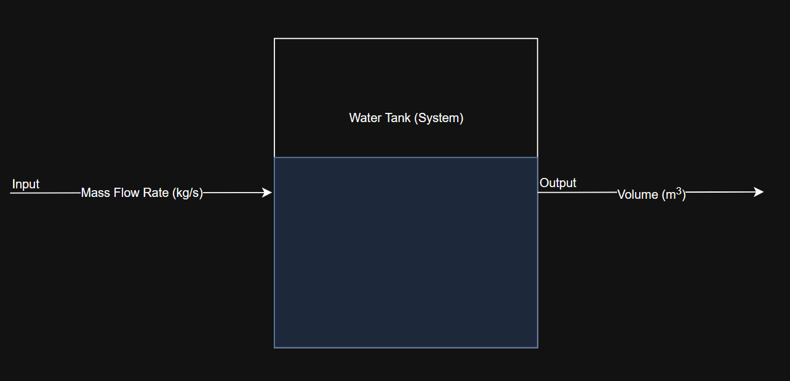

# Mathematical Model of a Water Tank

To build a mathematical model of a physical system, first we need to identify the input and output. 

As seen in the above block diagram, we choose the input as mass flow rate, $\dot{m}$ ($kg/s$)  and output as volume, $V$ ($m^3$).

We need to find a relation which gives output as a funtion of input, i.e., $V$ as a function of $\dot{m}$

Mass flow rate,

$$
    \dot{m} = \frac{d(mass_w)}{dt}
$$

where $mass_w$ is the mass of water

$$
    mass_w = vol_w \times density_w = vol_w \times \rho_w
$$

$$
    \dot{m} = \frac{d(vol_w \times \rho_w)}{dt}

$$

$$
   \dot{m} = \frac{d(vol_w)}{dt} \times \rho_w + \frac{\rho_w}{dt} \times vol_w
$$

As inside the tank, there is only water, the density is constant so the term $\frac{d(\rho_w)}{dt}$ becomes zero

$$
    \dot{m} = \frac{d(vol_w)}{dt} \times \rho_w
$$

$$
\boxed{
    \frac{d(vol_w)}{dt} = \frac{1}{\rho_w} \times \dot{m}
}
$$

We want output as a function of input - Volume as a function of mass flow rate. So we integrate the above equation to get the function.

$$
    \int_{vol_i}^{vol(t)} d(vol) = \int_0^t \frac{1}{\rho} \dot{m} \space dt = \frac{1}{\rho}\int_0^t \dot{m} \space dt
$$

$$
    vol(t) - vol_i = \frac{1}{\rho} \int_0^t \dot{m} \space dt
$$

$$
\boxed{
    vol(t) = vol_i + \frac{1}{\rho} \int_0^t \dot{m} \space dt
}
$$

The above is continuous form of the mathematical model for the system.

Using numerical integration (trapezoidal rule), we can derive a discrete form of the mathematical model for the system.

$$
    \boxed{
    vol(t_j) = vol(t_{j-1}) + \left(\frac{\frac{1}{\rho} \dot{m}[t_{j-1}] + \frac{1}{\rho} \dot{m}[t_{j}]}{2}\right) \Delta t
    }
$$

The above equation is the discrete form of the mathematical model for the water tank system. This model is used in computer programs.
